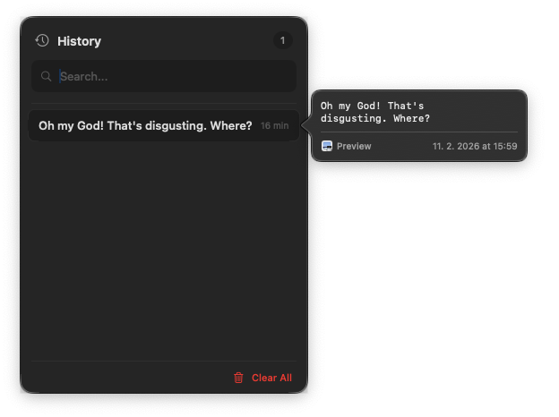
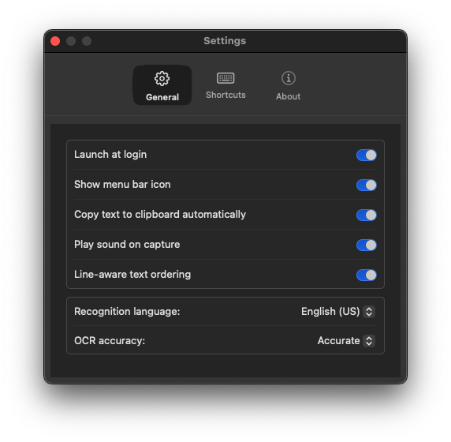

# Kimeno

A lightweight macOS menu bar OCR utility that captures screen areas and extracts text using Apple's Vision framework.

https://github.com/user-attachments/assets/2f3ff34f-0051-4c75-84a2-0a6cd3709cb7

## Features

- **Quick Screen Capture** - Select any area on screen with a simple drag gesture
- **Instant OCR** - Text extraction powered by Apple's Vision framework
- **Multi-Display Support** - Works seamlessly across multiple monitors with Retina scaling
- **Capture History** - Searchable history of past captures (up to 100 entries)
- **Auto-Copy to Clipboard** - Extracted text is automatically copied for immediate use
- **Customizable Shortcuts** - Configure global hotkeys for capture and history access
- **Multi-Language OCR** - Supports 11 languages including English, German, French, Spanish, Chinese, Japanese, and Korean
- **Line-Aware Text Ordering** - Intelligent text ordering that respects document layout
- **Launch at Login** - Optional startup on system boot
- **Native macOS Experience** - Built with SwiftUI and AppKit, no external dependencies

## Screenshots

#### History
 

#### Settings
 

## Requirements

| Requirement | Minimum |
|-------------|---------|
| **macOS** | 13.0 (Ventura) or later |
| **Permissions** | Screen Recording |
| **Architecture** | Apple Silicon & Intel |

## Installation

### Download

Download the latest release from the [Releases](../../releases) page.

### Build from Source

```bash
# Clone the repository
git clone https://github.com/yourusername/kimeno.git
cd kimeno

# Build release version
xcodebuild -project kimeno.xcodeproj -scheme kimeno -configuration Release

# The built app will be in build/Release/kimeno.app
```

## Usage

1. **Launch Kimeno** - The app appears as "κ" in your menu bar
2. **Capture Text** - Press the capture shortcut (default: `⌘⇧2`) or click "Capture" from the menu
3. **Select Area** - Click and drag to select the screen region containing text
4. **Done** - Text is extracted and copied to your clipboard automatically

### Default Keyboard Shortcuts

| Action | Shortcut |
|--------|----------|
| Capture | `⌘⇧2` |
| History | `⌘⇧H` |
| Settings | `⌘,` |
| Quit | `⌘Q` |

Shortcuts can be customized in Settings > Shortcuts.

## Settings

Access settings via the menu bar icon > Settings, or press `⌘,`.

### General
- Launch at login
- Auto-copy to clipboard
- Play sound on capture
- Line-aware text ordering (for proper left-to-right reading)

### Recognition Language
Choose from: English (US/UK), German, French, Spanish, Italian, Portuguese, Chinese (Simplified/Traditional), Japanese, Korean

### Shortcuts
Customize global hotkeys for capture and history access.

## Permissions

Kimeno requires **Screen Recording** permission to capture screen content.

On first launch, macOS will prompt you to grant this permission. You can also enable it manually:

1. Open **System Settings** > **Privacy & Security** > **Screen Recording**
2. Enable the toggle for **Kimeno**

## Project Structure

```
kimeno/
├── App/                    # App entry point
├── Managers/               # Core business logic
│   ├── ScreenCaptureManager.swift
│   ├── HotkeyManager.swift
│   ├── SettingsManager.swift
│   └── CaptureHistoryStore.swift
├── Models/                 # Data models
├── Selection/              # Screen selection overlay
├── Settings/               # Settings UI
├── History/                # History panel
├── UI/                     # Shared UI components
└── Extensions/             # Swift extensions
```

## Running Tests

```bash
# Unit tests
xcodebuild -project kimeno.xcodeproj -scheme kimeno test

# UI tests
xcodebuild -project kimeno.xcodeproj -scheme kimeno -destination 'platform=macOS' test
```

